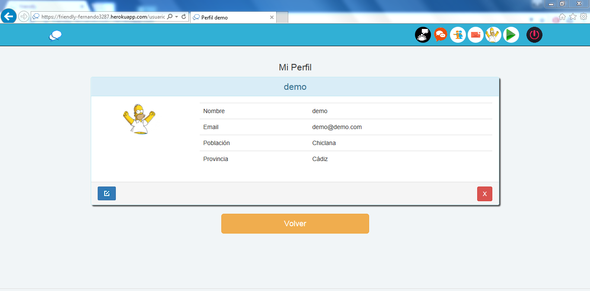
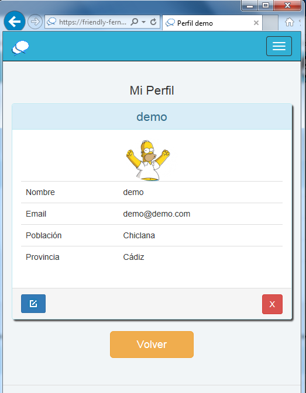

 **Friendly**
==================

### vista de la aplicación en Internet Explorer
-------------------------------------------

** Vista desde Internet explorer ampliado**

** Vista desde Internet explorer pequeño**

