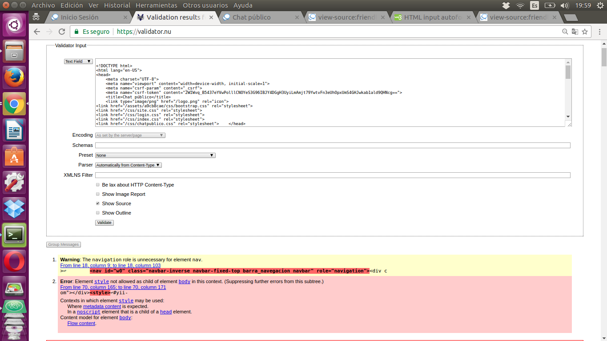
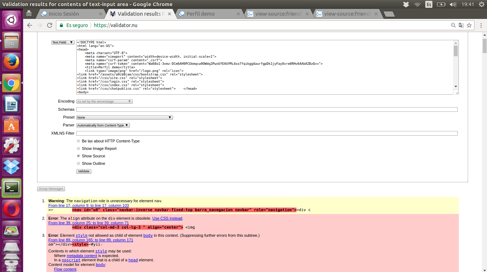
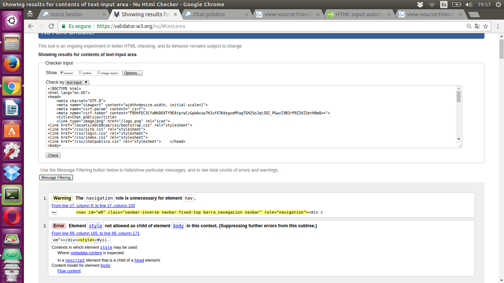
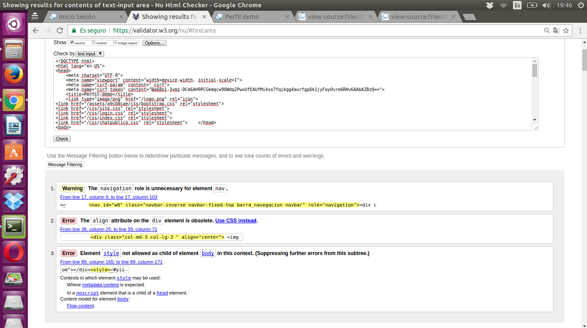

 **Friendly**
==================

### Validación html 5

-------------------------------------------

** Estos son algunos de los resultados al hacer la validación html5 en diferentes validadores: **

1. Validaciones de validator.nu

1. Validaciones de validator.w3.org

