 **Friendly**
==================

### Manual básico de usuario
------------------------

#### Pantalla login:
> Esta es la pantalla de entrada a la aplicación, usuarios registrados o no tienes que pasar por aquí para hacer login o registrarse.

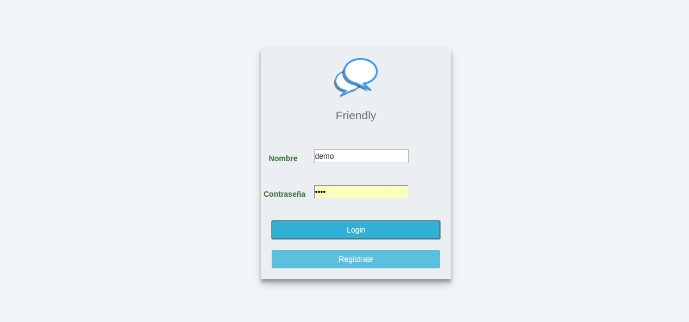

------------------------

#### Pantalla principal:
> Si estamos registrado y hacemos login vamos a la página principal. Esta es la vista principal de la aplicación, donde entramos cuando hacemos login y donde volvemos después de estar en cualquiér otra página.

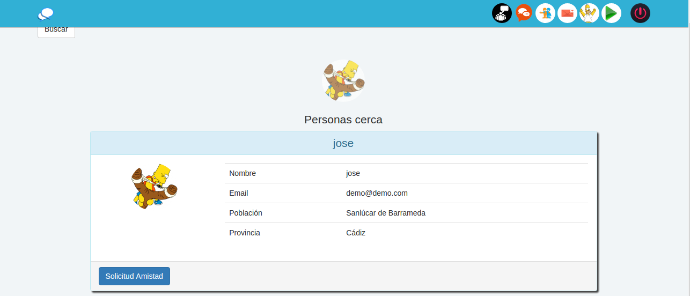

------------------------

#### Pantalla Registrarse:
> Si no estamos registrados, en la pantalla de login pulsamos el botón de registrarse y nos llevará a esta pantalla. Una vez introducido nuestros datos nos enviará un email de conformación con un enlace.

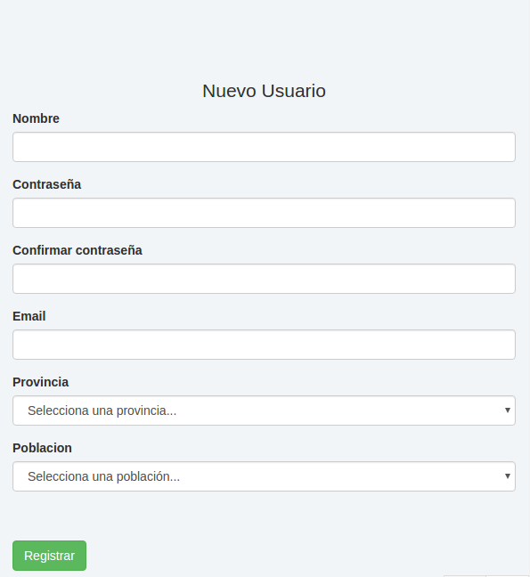

------------------------

#### Email de validación:
> este email viene con un enlace que si lo pulsamos nos validará nuestro usuario y de esta manera, lroxima vez que estemos en la pantalla de login, podremos entrar a la aplicación sin necesidad de registrarnos.

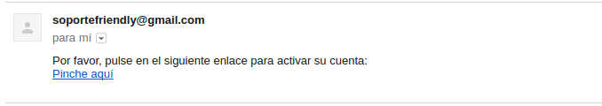

------------------------

#### Buscar en la página principal:

> Para buscar debemos pulsar el botón para que se abra el menú.

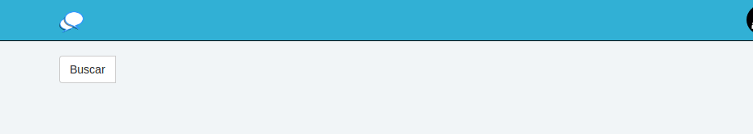

> pulsando el botón de buscar se abrirá siguiente pantalla
> Esta pantalla cuenta con una lista desplegable y un campo de texto acompañado de un botón de buscar.
> La lista desplegable cuenta con los criterios de búsqueda que desee el usuario.
> El campo de texto es el texto o palabra que desea buscar el usuario.
para buscar somplemente deje de escribir en el campo de texto o pulse el botón  de buscar.

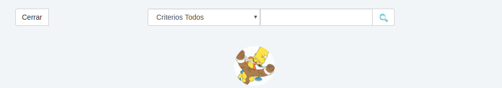

> Usando Ajax, la aplicación busca según los criterios elegidos por el usuario y el campo de texto.
> Este es un ejemplo de una búsqueda.
> Para dejar de buscar pulsa el botoón de cerrar y se vuelve a cerrar el menú de búsqueda.  

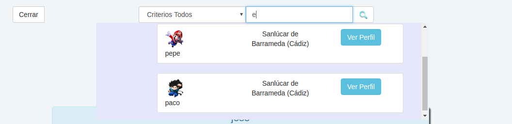

------------------------

#### Botones del menú de navegación

> El primero se encuentra a la izquierda y sirve para volver a la página principal en cualquier momento.

> El segundo que nos encontramos es el que nos llevaría al char de grupo donde todos los usuarios conectados pueden hablar.

> El tercer botón nos lleva al chat privado entre amigos. Aquí los usuarios que tengan iniciada sesión y tengan amigos conectados podrán hablar de forma privada con ellos.

> El cuarto botón nos lleva a las peticiones de amistad recibidas por el usuario.

> El quinto botón lleva al usuario a su perfil, y si tiene foto, aparecerá su foto de perfil en el botón.

> Este sexto botón abre en una nueva ventana un reproductor mp3 con canciones predefinidas y donde el usuario podrá cambiar de canción cuando desee. Un poco de música ambiente.

> El último botón cierra la sesión del usuario.

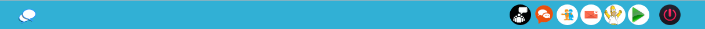

------------------------

#### Chat de grupo

> Esta pantalla nos muestra los mensajes enviados y recibidos por los usuarios conectados y una lista con los usuarios conectados en el momento actual.

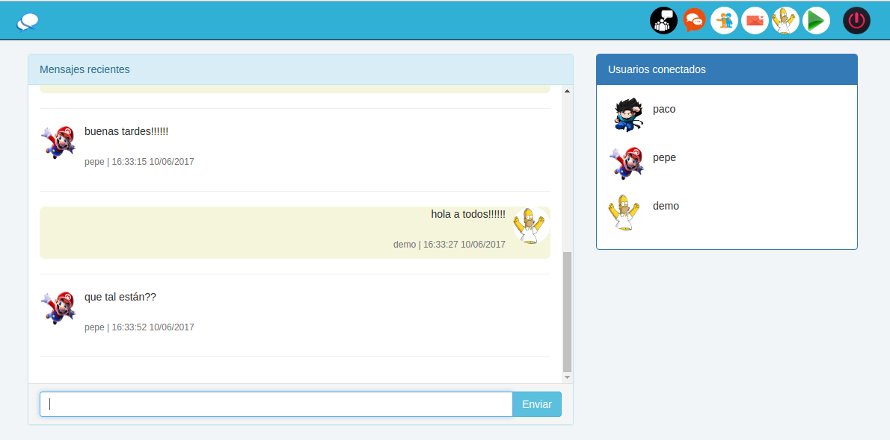

------------------------

#### Chat privado

> Esta pantalla de la lista de amigos conectados tienes que elegir con quien quieres hablar y su conversación aparecerá automáticamente en la conversación de la derecha, pudiendo cambiar de conversación con cualquier amigo de la lista.

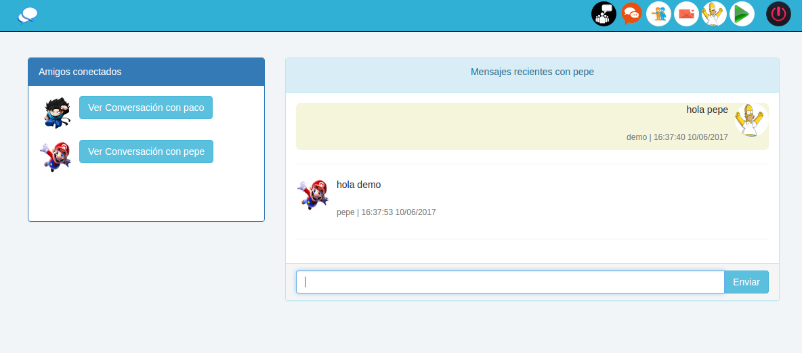

------------------------

#### Listado de amigos

> Esta pantalla aparece una lista de amigos del usuario, donde cada amigo tiene dos botones, uno es para ver el perfil de ese amigo y el otro es para borrarlo y dejar de ser su amigo.

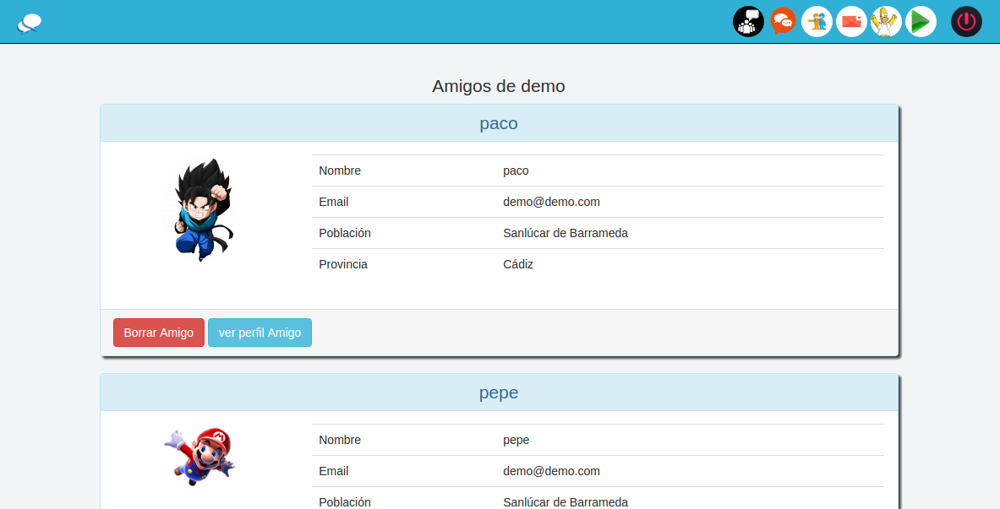

------------------------

#### Peticiones de amistad

> Esta pantalla muestra las peticiones de amistad recibidas por el usuario, donde podrá aceptarlas y que pase a ser un amigo o puede rechazarla.

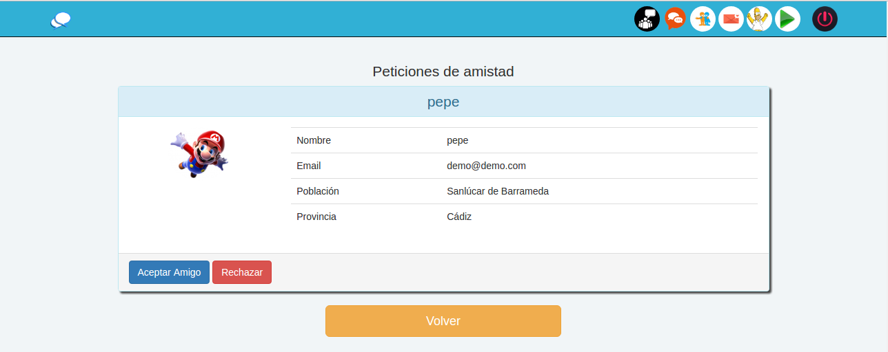

------------------------

#### Perfil de usuario

> Esta pantalla te muestra tu propio perfil en el que podrás modificar tus datos o borrar tu propio usuario.

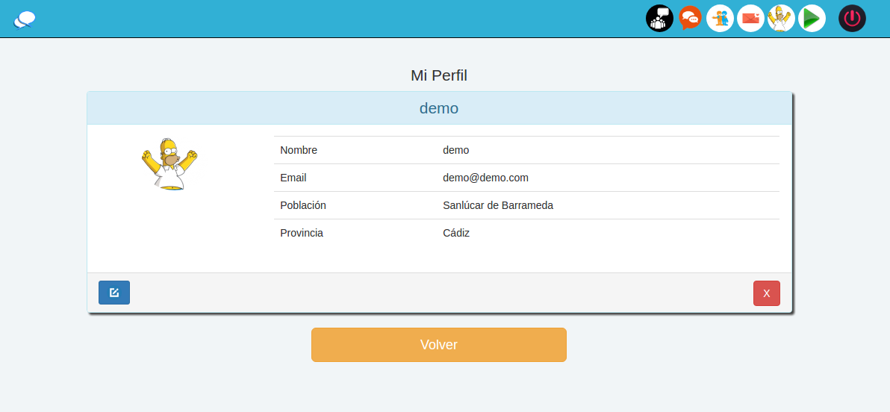

------------------------

#### Modificar perfil usuario

> Esta pantalla permite al usuario rellenar solo los datos que desea cambiar de su perfil, lo que no quiera cambiar que no lo toque.

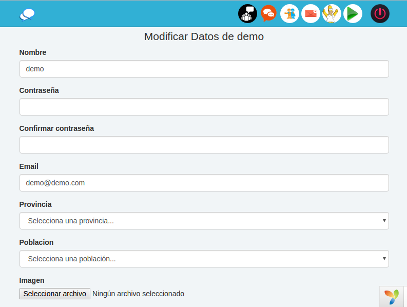

------------------------

#### Reproductor

> Abre una nueva ventana y muestra el reproductor y la lista de canciones que puede elegir el usuario.

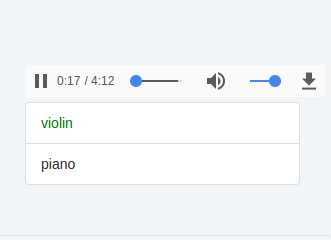

------------------------

#### Pantalla sobre nosotros.

> El enlace esta al pie de pagina y muestra información sobra la red social.

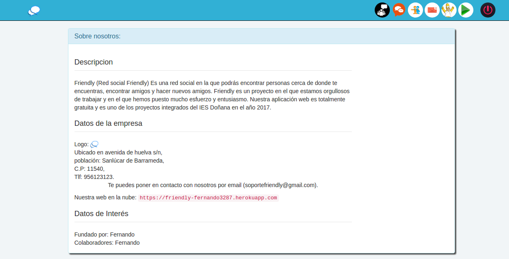
