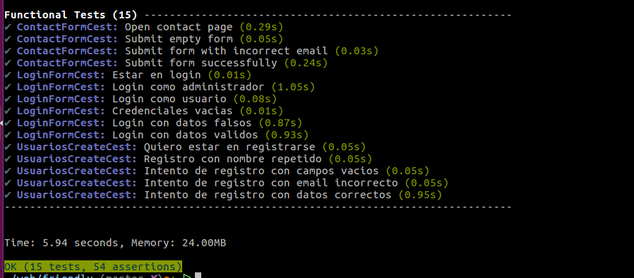

 **Friendly**
==================

### Resultado pruebas funcionales
-------------------------------------------

** Resultado de las pruebas funcionales**

ejecutar :
        vendor/bin/codecept run functional

